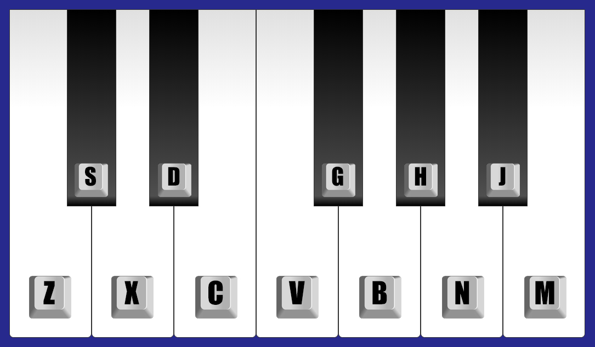

<h1 align="center">🎹 Piano</h1>

Um simples piano tocável desenvolvido com JavaScript.

  

  

  

  

  

## 🚧 Projeto

### Um piano virtual que pode ser tocado usando o clique do mouse ou as teclas correspondentes do teclado.

## 💻 Tecnologias

### Esse projeto foi desenvolvido com as seguintes tecnologias:

- [JavaScript](https://www.javascript.com/)

## 📝 Licença

#### Esse projeto está sob a licença MIT. Veja o arquivo [LICENSE](LICENSE.md) para mais detalhes.

